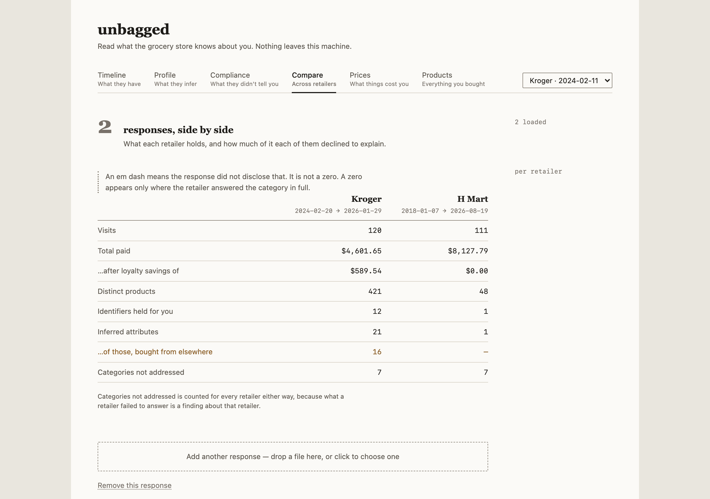

# unbagged

[](https://github.com/jdmacleod/unbagged/actions/workflows/ci.yml)
[](https://www.python.org/downloads/)
[](LICENSE)

**Read what the grocery store knows about you.**

You file a right-to-know request with a grocery retailer. Weeks later a PDF arrives
containing raw internal JSON, or a zip of CSVs, or a letter. It is technically compliant
and practically unreadable.

`unbagged` reads those responses, normalizes them into a common schema, and shows three
things:

1. **What they have** — a purchase timeline, an identity graph, drill-down to line items.
2. **What they infer** — modeled and appended attributes, separated by likely origin.
   Demographic and household attributes are usually not derivable from your baskets,
   which suggests they were obtained somewhere the report does not name.
3. **What they didn't tell you** — each of the eight CCPA/CPRA disclosure categories,
   with the retailer's own words where it answered and a blank rule where it did not.
   Absence is recorded as a finding, not as a blank.


## Quickstart

Three commands, no Python install, no Node install, no database setup.

```bash
git clone https://github.com/jdmacleod/unbagged
cd unbagged
docker compose up --build
```

Then open <http://localhost:8420> and drag the retailer's response onto the upload
area. Drop the zip it arrived in as it is: each file inside becomes its own
document with its own citation, so nothing has to be unpacked by hand. An archive
is refused rather than half-read if it will not open, holds another archive, names
a path outside itself, or carries more files or bytes than a response plausibly
contains — and the refusal says which. A member that cannot be read, usually
because the archive is password-protected, says so rather than being skipped in
silence.

A spreadsheet or a word-processor file is itself a zip, and is left alone: one
document, not the XML parts inside it.

The first run builds the app: two base images, the OCR engine, the UI, and the
Python dependencies. Budget a couple of minutes on a clean machine. There is no
prebuilt image to download, deliberately — you run what you can read. Later starts
re-check the build in about two seconds when nothing has changed. Keep `--build`
on the command: without it Docker serves whatever it built last, so a pull can
leave you running the previous version.

A text or PDF response reads in about a second. A response that arrived as
screen captures takes longer, because every image goes through OCR.

Your database and uploads live in `./data`, on your disk. Back it up by copying
that directory.

**No response yet?** A request takes weeks to come back, so the repo ships two
synthetic ones you can drop in now to see what the views do:

```
src/unbagged/adapters/kroger/fixtures/synthetic_report.txt
src/unbagged/adapters/hmart/fixtures/          # the statement and its captures
```

Drop the H Mart directory's files in together: the statement says what each visit
cost and the captures say what was in it, and the app stores a basket only where
the two agree.

They are generated, not anyone's shopping. `make fixtures` rebuilds them and CI
fails if a committed file is not what the generator produces. They reproduce the
quirks of the real formats on purpose, including the ones that look like bugs — a
basket whose lines do not add up to the total the retailer stated for it, and a
receipt capture clipped so badly that nothing from it can be trusted. Every
screenshot in this README comes from them.

### Running it

| | |
|---|---|
| `docker compose up --build` or `make up` | Start it, on <http://localhost:8420> |
| `make down` | Stop it and remove the container |
| `make logs` | Follow the logs |
| `make reset CONFIRM=yes` | Move `./data` aside to `data.bak-<timestamp>` and start empty. Nothing is deleted; remove the backup yourself when you are sure. |

Uploaded the wrong file? Remove that one response rather than resetting
everything: the control is at the foot of the page, under the uploader, and asks
twice — the second step names the retailer. It removes the reading, not the file
you uploaded, which stays in `data/`.

To use a different port, copy `.env.example` to `.env` and set `UNBAGGED_PORT`.
The app is only ever published on `127.0.0.1`; that part is not configurable, and
it is what keeps your report off your local network.

## What you get

**Timeline** — every visit over the coverage window, with the header numbers above
it. Click a basket to expand its line items. The shelf price and the price you paid
sit side by side rather than as a single saving, so the subtraction is checkable.
Each basket is checked against the total the retailer stated for it, and the ones
that disagree are marked "over by" or "under by" — a real response has plenty, and
the difference is usually in the document as supplied rather than in how it was
read, so there is nothing to correct.

**Profile** — the identifiers the retailer holds, and the attributes it has inferred,
split by origin: scores modelled from your own baskets in one column, attributes
obtained somewhere the report does not name in the other. Anything describing your
*household* rather than you is called out, because those describe people who never
signed up for anything.


**Compliance** — the eight CCPA/CPRA categories per retailer, with the answer quoted
where there is one and a blank rule where there is not. "Draft a follow-up" writes a
supplemental request naming what went unanswered; you read it and send it yourself.
Where the eight categories come from and why each is graded as it is, with the
citation for each, is [`docs/legal-basis.md`](docs/legal-basis.md).


**Compare** — two retailers side by side once a second response arrives. An em dash
means the retailer did not disclose that, and is never shown as a zero.



**Prices** — a per-product price series. A line carries an amount and nothing else,
no quantity and no weight, so Prices classifies each product by the shape of its own
amounts and draws a series only for those that behave like a unit price. The rest are
listed with what their amounts look like, and no price change is claimed for them.


**Products** — the products you bought, set as a typographic index: alphabetical,
sized by purchase count, with an A-Z rail. Clicking one opens the visits that
contained it. Deposits, taxes and other receipt furniture are not products and are
not listed; the page says how many entries it set aside rather than quietly
shrinking the count. Under the index, a control saves the page as an SVG — text,
not a rasterised screenshot, so it stays selectable and scales to a wall print. It
exports what is on screen, filters included.


## Supported responses

| Retailer | State |
|---|---|
| Kroger | Full adapter — purchases, identity graph, inferred attributes, disclosures |
| Safeway (Albertsons) | Stub. Expectations recorded in its `NOTES.md`; no real response seen |
| H Mart | Full adapter — a spreadsheet export of basket totals, plus screen captures of its receipt viewer where those were supplied, which carry the line items the spreadsheet does not |
| Anything else | Fallback: read as text, disclosures recorded, no data extracted |

Kroger and H Mart are the two full adapters because they are the two formats anyone
has had a real response for. A retailer with no adapter still works: the fallback
reads the response as text and records what it did and did not address, since a
letter with no data in it is itself the finding.

Adding a retailer should not require touching code outside its own package. See
`docs/writing-an-adapter.md`.

## Working on it

```bash
make setup           # venv, dev deps, git hooks
make setup-frontend  # npm install
make dev             # compose + Vite, on http://localhost:5173
make test            # fast suite
make test-frontend   # UI unit tests (vitest)
make setup-browser   # once: without it the browser tests SKIP rather than run
make test-container  # slow: builds and runs a real container (needs Docker + Chromium)
make lint            # ruff check + ruff format --check, the two gates CI runs
make format          # apply the formatter
make screenshots     # regenerate docs/screenshots from the fixture
make check-pii       # run this before every commit
```

`make dev` serves one URL, <http://localhost:5173>, hot-reloading both halves with
the API proxied at `/api`. The backend's own port is deliberately not published in
dev: it would serve the bundle frozen into the image at build time, with no way to
tell from a browser.

`make test-container` checks what only a running container can show: how it starts,
what it may touch on disk, and what the app does in a browser between dropping a
file and reading the report. Anything involving a real DOM belongs there;
`CONTRIBUTING.md` explains which tier a given test goes in and why.

`make help` lists the rest. `CONTRIBUTING.md` covers the PII safeguards, which you
should read before putting a real report anywhere near this repository.

## Your data stays on your machine

- Local-first and single-user. No accounts, no hosted service, no telemetry, no crash
  reporting, no update checks.
- The app binds to `127.0.0.1` by default, and the published Docker port is
  `127.0.0.1`-scoped too. Without that prefix Docker publishes on every interface
  and goes straight through the host firewall. LAN access is an explicit opt-in,
  and `unbagged serve` warns on stderr if you ask for it.
- Every byte the page loads is served from the app itself. No CDN, no web font,
  no third-party request: the type is the system stack and ships no font file at
  all. `tests/test_frontend_build.py` asserts that against the built output.
- Your reports live in `data/`: gitignored wholesale, kept out of the Docker build
  context, and guarded by a pre-commit hook, a scanner and a CI gate. If you plan to
  contribute, read `CONTRIBUTING.md` before you put anything there.

Security issues go through GitHub's private vulnerability reporting; see
`SECURITY.md`.

## Responses that arrive as pictures

One store could only supply screen captures of its receipt viewer, one or two per
visit. Those are read, and read carefully:

- Drop the images in alongside the rest of the response, or drop the zip they
  arrived in. They belong to one upload, not one each.
- **Nothing is stored unless the basket adds up.** A receipt prints its own
  total, so a transcription can be checked against something that did not come
  out of the same reader. One that does not reconcile is named in a warning and
  its visit keeps the total it already had.
- **A page captured with its edge cut through the amounts is set aside on the
  cut**, before the arithmetic is consulted at all. A clip slices the last digit
  off every amount rather than removing it, and each sliver reads as some other
  digit — so such a page can add up perfectly while every figure on it is wrong.
  Adding up is not evidence there.
- Nothing from the card block at the foot of a receipt is transcribed or stored.

Reading is done by tesseract, which ships in the image. A local vision model can be
asked about the pages tesseract could not read, and is **off unless you turn it on**
— see `.env.example`. Its answer is kept only if it makes the receipt add up, the
same gate everything else passes.

The model it asks for, `minicpm-v4.5:8b`, came out of a bake-off of twelve: nothing
measured read more of a page, and of the three that read as much it was the fastest.
It wants a host with roughly 8GB of GPU or unified memory free, where it answers a
page in about eight seconds; on a CPU it takes minutes. `.env.example` has the rest
of what the host needs, and `src/unbagged/adapters/hmart/NOTES.md` has the
measurements.

## What this is not

- **Not a request generator.** Use [Datenanfragen](https://www.datarequests.org/) to file.
- **Not legal advice.** The compliance view reports observations. It never concludes
  that a retailer broke the law.
- **Not a hosted service**, and not a general data-takeout viewer. Scope is legally
  compelled access responses.

## License

MIT. See `LICENSE`.
