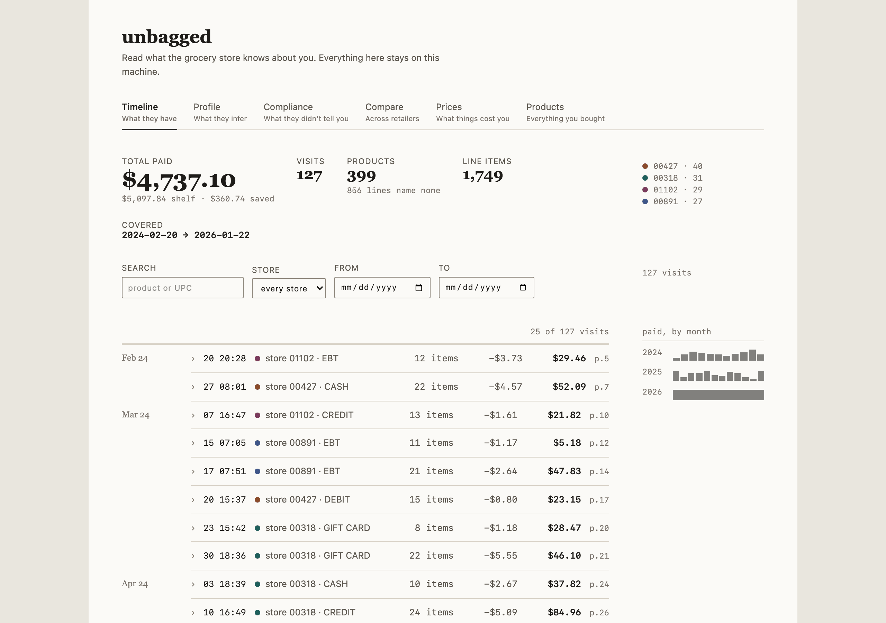
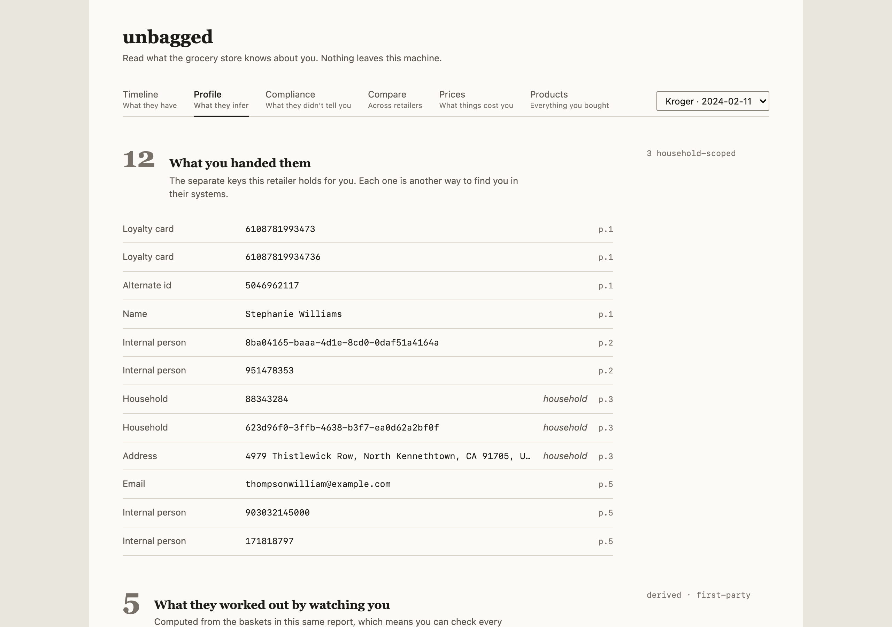
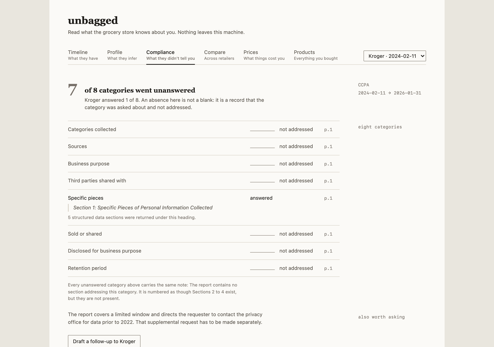
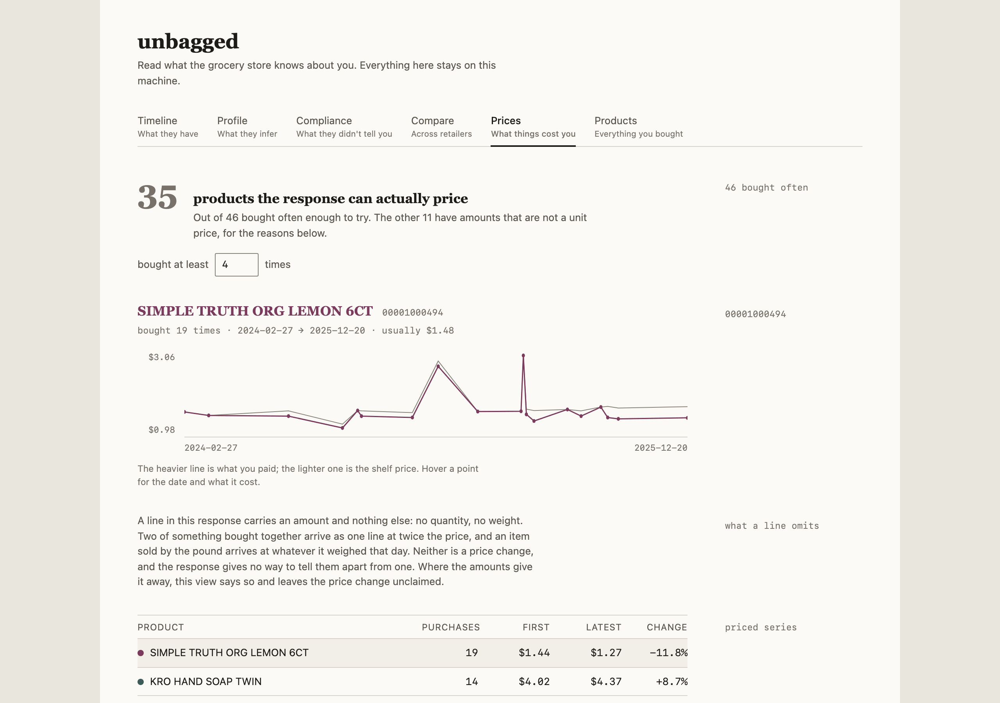
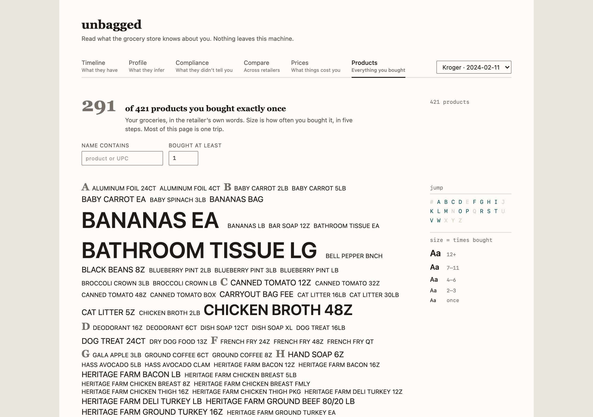

# unbagged

[](https://github.com/jdmacleod/unbagged/actions/workflows/ci.yml)
[](https://www.python.org/downloads/)
[](LICENSE)

**Read what the grocery store knows about you.**

You file a right-to-know request with a grocery retailer. Weeks later a PDF arrives
containing raw internal JSON, or a zip of CSVs, or a letter. It is technically compliant
and practically unreadable.

`unbagged` reads those responses, normalizes them into a common schema, and shows three
things:

1. **What they have** — a purchase timeline, an identity graph, drill-down to line items.
2. **What they infer** — modeled and appended attributes, separated by likely origin.
   Demographic and household attributes are usually not derivable from your baskets,
   which suggests they were obtained somewhere the report does not name.
3. **What they didn't tell you** — each of the eight CCPA/CPRA disclosure categories,
   with the retailer's own words where it answered and a blank rule where it did not.
   Absence is recorded as a finding, not as a blank.



## Quickstart

Three commands, no Python install, no Node install, no database setup.

```bash
git clone https://github.com/jdmacleod/unbagged
cd unbagged
docker compose up
```

Then open <http://localhost:8420> and drag the retailer's response onto the upload
area.

The first run builds the app: it pulls two base images, compiles the UI, and
installs the Python dependencies, which took about 75 seconds on a clean machine.
There is no prebuilt image to download, deliberately — you run what you can read.
Later starts are immediate. Reading a long report takes 10 to 30 seconds.

Your database and uploads live in `./data`, on your disk. Back it up by copying
that directory.

**No response yet?** A request takes weeks to come back, so the repo ships a
synthetic one you can drop in now to see what the views do:

```
src/unbagged/adapters/kroger/fixtures/synthetic_report.txt
```

It is generated, not anyone's shopping. `make fixtures` rebuilds it, and CI fails
if the committed file is not exactly what the generator produces. It reproduces
the quirks of the real Kroger format on purpose, including the ones that look like
bugs. Every screenshot in this README comes from it.

### Running it

| | |
|---|---|
| `docker compose up` or `make up` | Start it, on <http://localhost:8420> |
| `make down` | Stop it and remove the container |
| `make logs` | Follow the logs |
| `make reset CONFIRM=yes` | Move `./data` aside to `data.bak-<timestamp>` and start empty. Nothing is deleted; remove the backup yourself when you are sure. |

To use a different port, copy `.env.example` to `.env` and set `UNBAGGED_PORT`.
The app is only ever published on `127.0.0.1`; that part is not configurable, and
it is what keeps your report off your local network.

## What you get

**Timeline** — every visit over the coverage window, with the header numbers above
it. Click a basket to expand its line items, showing the shelf price and the price
you actually paid side by side. `customerloyamt` is what the line cost, not a
discount to subtract, so the saving is the difference between the two; both stay on
screen so the subtraction is checkable. Each basket is checked against the total the
retailer states for it and says so when they disagree.

**Profile** — the identifiers the retailer holds, and the attributes it has inferred,
split by origin. Scores modelled from your own baskets sit in one column; attributes
obtained somewhere the report does not name sit in the other. Anything describing your
*household* rather than you is called out, because those describe people who never
signed up for anything.



**Compliance** — the eight CCPA/CPRA categories per retailer, with the answer quoted
where there is one and a blank rule where there is not. A "draft a follow-up" action
writes a supplemental request naming what went unanswered; you read it and send it
yourself.



**Compare** and **Prices** — two retailers side by side once a second response
arrives, and a per-product price series. A line carries an amount and nothing else,
no quantity and no weight, so Prices classifies each product by the shape of its own
amounts and draws a series only for those that behave like a unit price. The rest are
listed with what their amounts look like, and no price change is claimed for them.



**Products** — every product the response discloses, set as a typographic index:
alphabetical, sized by purchase count, with an A-Z rail. Clicking one opens the visits
that contained it. Under the index is a control that saves what you are looking at
as an SVG — text, not a rasterised screenshot, so it stays selectable and searchable
and scales to a wall print. It exports what is on screen, filters included.



## Supported responses

| Retailer | State |
|---|---|
| Kroger | Full adapter — purchases, identity graph, inferred attributes, disclosures |
| Safeway (Albertsons) | Stub. Expectations recorded in its `NOTES.md`; no real response seen |
| H Mart | Stub. A letter is handled by the fallback already |
| Anything else | Fallback: read as text, disclosures recorded, no data extracted |

Kroger is the only full adapter, because it is the only format anyone has had a real
response for. A retailer with no adapter still works: the fallback reads the response
as text and records what it did and did not address, since a letter with no data in it
is itself the finding.

Adding a retailer should not require touching code outside its own package. See
`docs/writing-an-adapter.md`.

## Working on it

```bash
make setup           # venv, dev deps, git hooks
make setup-frontend  # npm install
make dev             # compose + Vite, on http://localhost:5173
make test            # fast suite
make test-frontend   # UI unit tests (vitest)
make test-container  # slow: builds and runs a real container
make setup-browser   # once, if you want the layout test to run rather than skip
make screenshots     # regenerate docs/screenshots from the fixture
make check-pii       # run this before every commit
```

`make dev` serves one URL, <http://localhost:5173>, hot-reloading both halves with
the API proxied at `/api`. The backend's own port is deliberately not published in
dev: it would serve the bundle frozen into the image at build time, with no way to
tell from a browser.

`make test-container` builds and runs a real container and checks the things only a
running one can show: effective uid, data permissions, bounded restart, that the
shipped image is the runtime stage, and that no view scrolls sideways from 320px up.
Tests needing real uid semantics skip loudly on Docker Desktop, where bind-mount
ownership is remapped and they would otherwise pass without checking anything.

`make help` lists the rest. `CONTRIBUTING.md` covers the PII safeguards, which you
should read before putting a real report anywhere near this repository.

## Your data stays on your machine

- Local-first and single-user. No accounts, no hosted service, no telemetry, no crash
  reporting, no update checks.
- The app binds to `127.0.0.1` by default, and the published Docker port is
  `127.0.0.1`-scoped too. Without that prefix Docker publishes on every interface
  and goes straight through the host firewall. LAN access is an explicit opt-in,
  and `unbagged serve` warns on stderr if you ask for it.
- Fonts and JS are vendored, so the app works offline and makes no third-party
  requests. `tests/test_frontend_build.py` asserts this against the built output.
- Your reports live in `data/`: gitignored wholesale, kept out of the Docker build
  context, and guarded by a pre-commit hook, a scanner and a CI gate. If you plan to
  contribute, read `CONTRIBUTING.md` before you put anything there.

Security issues go through GitHub's private vulnerability reporting; see
`SECURITY.md`.

## What this is not

- **Not a request generator.** Use [Datenanfragen](https://www.datarequests.org/) to file.
- **Not legal advice.** The compliance view reports observations. It never concludes
  that a retailer broke the law.
- **Not a hosted service**, and not a general data-takeout viewer. Scope is legally
  compelled access responses.

## License

MIT. See `LICENSE`.
